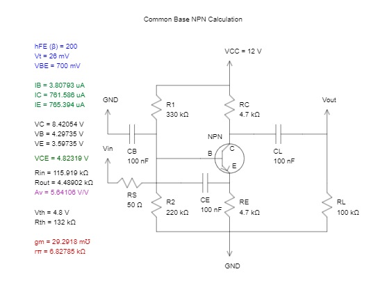
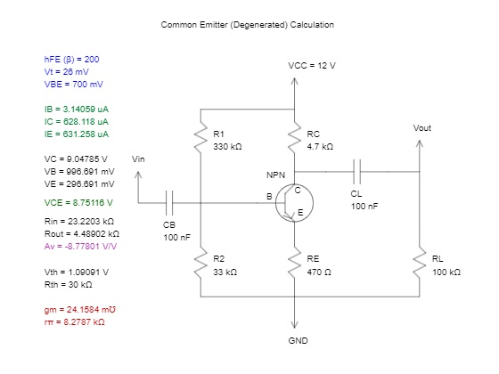
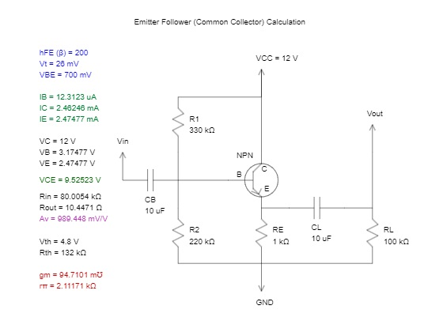

# YNSRC - Electronics Examples

This project contains GNU Octave examples.

# How To Run
You can use [Octave Online](https://octave-online.net) to run this examples. Or you can download and install GNU Octave application into your computer.

# Emitter Degenerated BJT Circuits

## BJT - NPN - Common Base

## BJT - NPN - Common Emitter

## BJT - NPN - Emitter Follower (Common Collector)

# License
CC BY 4.0 LEGAL CODE
Attribution 4.0 International

Feel free to use this code in your personal, open-source or even commercial projects. Only attribution needed.
